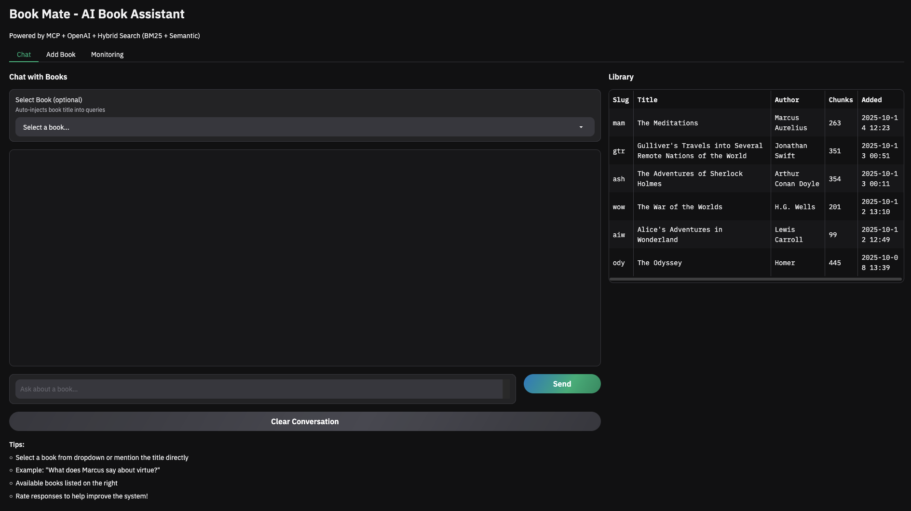
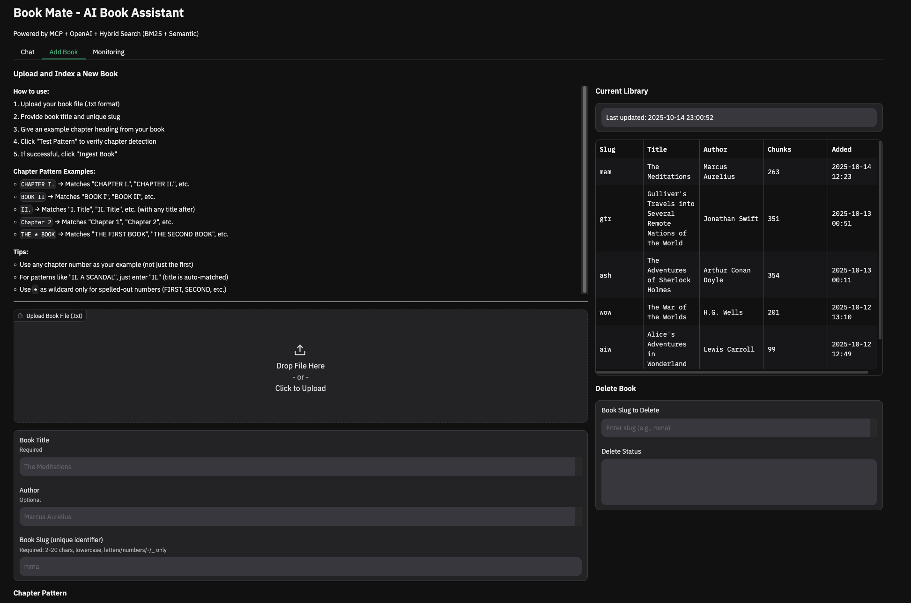
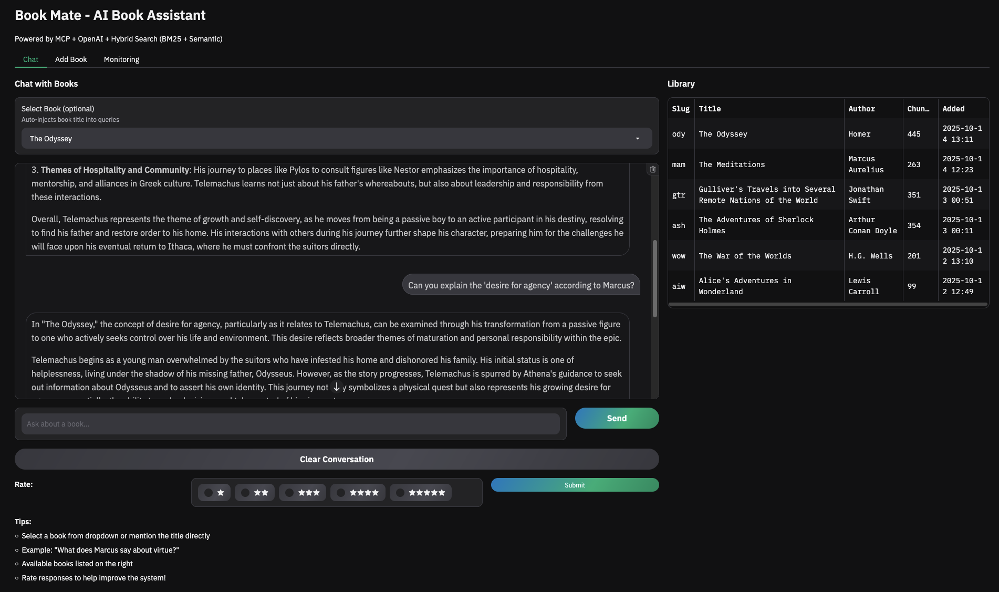
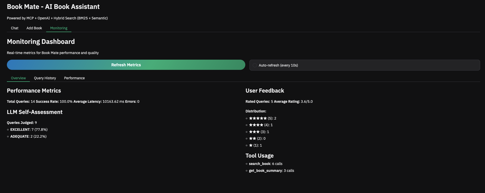

# Book Mate

A book assistant (powered by LLMs) that lets you upload books, chat with their content, and seek answers about book content using hybrid search (BM25 + vector embeddings) and MCP (Model Context Protocol) workflow. 

## Features

- **Book Ingestion**: Upload and index books with automatic chapter detection
- **AI Chat Interface**: Ask questions about book content with context-aware responses
- **Hybrid Search**: Combines BM25 keyword search with semantic vector search
- **Automatic Query Retry**: When search returns no results, automatically rephrases and retries queries
- **Citations**: All responses include source citations with chapter numbers and chunk IDs
- **Monitoring Dashboard**: Track query performance, LLM quality assessments, user feedback, and retry statistics
- **MCP Integration**: Uses Model Context Protocol for tool-based agent interactions

## Quick Start

### Prerequisites
- Docker & Docker Compose
- OpenAI API Key

### Installation

Clone the repository

```zsh
git clone https://github.com/nupsea/book-mate.git
```

Set up environment

```zsh
cd book-mate
cp .env_template .env
```
> Update .env with your OPENAI_API_KEY


Build and start all services (PostgreSQL, Qdrant, Phoenix, UI)

```zsh
make build
make start
```

The UI will be available at http://localhost:7860
Phoenix tracing UI will be available at http://localhost:6006

**Useful commands:**
```bash
make up      # Start all services
make down    # Stop all services
make logs    # View app logs
make build   # Rebuild the app container
```



## Using Book Mate

### 1. Add a Book

Go to the "Add Book" tab:
1. Upload your book file (.txt format)
2. Enter book title, author, and a unique slug (e.g., "mam" for Meditations)
3. Provide a chapter pattern example (e.g., `CHAPTER I` or `* BOOK`)
4. Click "Test Pattern" to verify chapter detection
5. Click "Ingest Book" to index the content



### 2. Chat with Books

Go to the "Chat" tab:
1. Select a book from the dropdown (optional)
2. Ask questions like:
   - "What is this book about?"
   - "Search for passages about virtue"
   - "Give me examples of rejection of external validation"
3. Rate responses to help improve the system



### 3. Monitor Performance

Go to the "Monitoring" tab to view:
- Query performance metrics (latency, success rate)
- LLM self-assessments (EXCELLENT/ADEQUATE/POOR)
- User feedback ratings
- Tool usage statistics
- Query retry statistics (automatic rephrasing attempts and success rates)



### 4. View LLM Traces (Phoenix)

Go to http://localhost:6006 to access Phoenix for LLM observability:
- View all OpenAI API calls with full prompts and responses
- Trace conversation flows and tool usage
- Analyze token usage and latency
- Debug and optimize LLM interactions

## Project Structure

```
book-mate/
├── src/
│   ├── app/              # Main application entry points
│   ├── content/          # Book reading and storage
│   ├── flows/            # Ingestion and query workflows
│   ├── llm/              # LLM interfaces (summarization, embeddings)
│   ├── mcp_client/       # MCP client agent implementation
│   ├── mcp_server/       # MCP server with book tools
│   ├── monitoring/       # Metrics collection and quality assessment
│   ├── search/           # Hybrid search (BM25 + vector)
│   └── ui/               # Gradio UI components
├── notebooks/            # Jupyter notebooks for exploration and analysis
├── DATA/                 # Book files (.txt)
├── INDEXES/              # BM25 search indexes
├── docker-compose.yml    # PostgreSQL + Qdrant services
└── Makefile              # Common commands
```

**Notebooks**: The `notebooks/` directory contains Jupyter notebooks for initial exploration, search evaluation, and ground truth generation. These are useful for understanding search performance and experimenting with different approaches.

## Architecture

```
┌─────────────┐
│  Gradio UI  │
└──────┬──────┘
       │
┌──────▼────────────┐         ┌──────────────┐
│  BookMateAgent    │◄───────►│  OpenAI API  │
│  (MCP Client)     │         └──────┬───────┘
└──────┬────────────┘                │
       │                             │ OTLP traces
       │                        ┌────▼──────┐
       │                        │  Phoenix  │
       │                        └───────────┘
       │
┌──────▼────────────┐
│   MCP Server      │
│  (Book Tools)     │
└──────┬────────────┘
       │
       ├──────────►  ╭─────────────────────╮
       │             │    PostgreSQL       │
       │             ├─────────────────────┤
       │             │ Metadata, Summaries │
       │             ╰─────────────────────╯
       │
       ├──────────►  [BM25 Index] (Keyword Search)
       │
       └──────────►  ╭─────────────────────╮
                     │      Qdrant         │
                     ├─────────────────────┤
                     │   Vector Search     │
                     ╰─────────────────────╯
```

### Key Components

- **PostgreSQL**: Stores book metadata, summaries, and query metrics
- **Qdrant**: Vector database for semantic search
- **BM25**: Keyword-based search index
- **MCP Server**: Exposes book tools (search, summaries) to the agent
- **OpenAI**: Powers the conversational AI and embeddings
- **Phoenix**: LLM observability via OpenTelemetry traces

## Database Debug

```bash
psql -h localhost -U bookuser -d booksdb
# or
pgcli -h localhost -U bookuser -d booksdb
```

## CLI Usage (Advanced)

> **Note**: These commands can be run either:
> - **Inside Docker**: `docker compose exec app python -m <module>`
> - **On host with uv**: `source .env && uv run python -m <module>` (requires uv and Python 3.12+)

### Test MCP Agent Directly

```bash
# Inside Docker
docker compose exec app python -m src.mcp_client.agent

# Or on host with uv
source .env
uv run python -m src.mcp_client.agent
```

This runs the agent in CLI mode with a hardcoded test conversation.

### Query Books Programmatically

**Search for content:**
```bash
# Inside Docker
docker compose exec app python -c "
from src.flows.book_query import search_book_content
result = search_book_content('death', 'mam', limit=5)
print(f'\nFound {result[\"num_results\"]} results')
for i, chunk in enumerate(result['chunks'][:3], 1):
    print(f'\nPassage {i}:')
    print(chunk['text'][:200])
"

# Or with uv on host
uv run python -c "..."
```

**Get book summary:**
```bash
# Inside Docker
docker compose exec app python -c "
from src.flows.book_query import get_book_summary
result = get_book_summary('mam')
print(result['summary'])
"
```

**Get chapter summaries:**
```bash
# Inside Docker
docker compose exec app python -c "
from src.flows.book_query import get_chapter_summaries
result = get_chapter_summaries('mam')
print(f'Found {result[\"num_chapters\"]} chapters')
for ch in result['chapters'][:3]:
    print(f'\nChapter {ch[\"chapter_id\"]}:')
    print(ch['summary'][:150])
"
```

### Manual Book Ingestion

If you prefer CLI ingestion over the UI:

```bash
# Inside Docker
docker compose exec app python -m src.app.ingest

# Or with uv on host
# Edit src/app/ingest.py to set the book slug, then:
uv run python -m src.app.ingest
```

### Explore Search Indexes

```bash
# Inside Docker
docker compose exec app python -c "
from src.search.hybrid import FusionRetriever
retriever = FusionRetriever()
retriever.load_bm25_index()
print(f'Total documents indexed: {retriever.bm25.N}')
print(f'First 5 document IDs: {retriever.bm25.ids[:5]}')
"

# Or with uv on host
uv run python -c "..."
```

### Database Queries

```bash
# Check indexed books
psql -h localhost -U bookuser -d booksdb -c "SELECT slug, title, num_chunks FROM books;"

# Check metrics
psql -h localhost -U bookuser -d booksdb -c "SELECT COUNT(*), AVG(latency_ms), AVG(user_rating) FROM query_metrics;"

# View recent queries
psql -h localhost -U bookuser -d booksdb -c "SELECT query, llm_relevance_score, user_rating FROM query_metrics ORDER BY timestamp DESC LIMIT 10;"
```

## Evaluation

Initially evaluated the search results with both keyword-based and vector-based search using BM25 and Qdrant-based search.
Refer `notebooks/02_retrieval_with_qdrant.ipynb` for details.

```zsh
# Example evaluation output for "Alice in Wonderland"
BM25: {
  "hit_rate_at_5": 0.49361702127659574,
  "mrr_at_5": 0.32666666666666666,
  "hit_rate_at_7": 0.5404255319148936,
  "mrr_at_7": 0.33396149949341436,
  "total_queries": 235
}
Semantic: {
  "hit_rate_at_5": 0.33191489361702126,
  "mrr_at_5": 0.2027659574468085,
  "hit_rate_at_7": 0.42127659574468085,
  "mrr_at_7": 0.2165450861195542,
  "total_queries": 235
}
Hybrid RRF: {
  "hit_rate_at_5": 0.48936170212765956,
  "mrr_at_5": 0.28652482269503543,
  "hit_rate_at_7": 0.5872340425531914,
  "mrr_at_7": 0.3016210739614995,
  "total_queries": 235
}
```

Improved search performance with Hybrid RRF and BM25.
```zsh 
{
  "hit_rate_at_5": 0.8141414141414142,
  "mrr_at_5": 0.6090909090909091,
  "hit_rate_at_7": 0.8444444444444444,
  "mrr_at_7": 0.6138528138528138,
  "total_queries": 495
}
```
Finally, adopted the adaptive retriever approach with weighted BM25 and vector scores based on query type, leading to further improvements.

See [EVALUATION.md](EVALUATION.md) for details on generating ground truth and evaluating search performance.


## Screen Records

- 

## Future Work
- Refactor Agent and MCP Server for better modularity
- Host it on cloud (AWS/GCP/Azure)
- Support more book formats (PDF, EPUB)
- Improve user interface and experience
- Workflow recording 

## References & Acknowledgements
**LLM Zoomcamp:** Thanks to the learnings from DataTalks.Club and the various open source libraries and tools that made this possible
https://datatalks.club/courses/llm-zoomcamp/ 

**Project Gutenberg:** Thanks to the efforts of volunteers and organizations that provide free public domain book texts. https://www.gutenberg.org/

