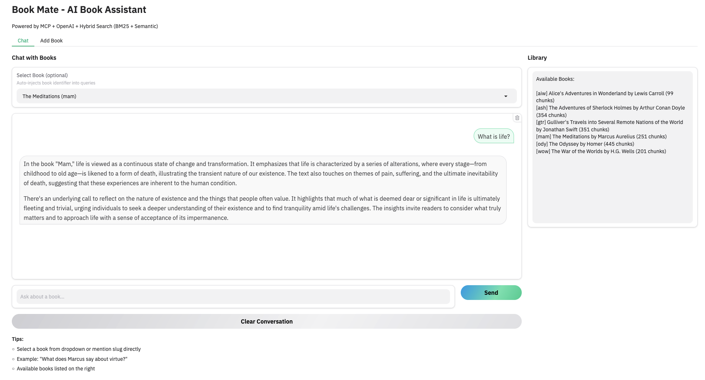

# book-mate
Upload the contents of a book and seek answers.


## Project Setup

### Prerequisites
- Python 3.10+
- Docker & Docker Compose
- OpenAI API Key
- PostgreSQL
- Qdrant (Vector DB)

### 1. Clone and Install
```zsh
git clone <repository-url>
cd book-mate

cp .env_template .env
# Update .env with your OpenAI API key, PG_USER and PG_PASS


uv pip install -e .

make start
# This starts PostgreSQL, Qdrant, and pgAdmin containers. 
# And also creates the metadata DB and users as per .env


# Check for running containers and their status and if need be the docker logs for any issues
docker ps
docker logs <container_id>

```

### 2. Ingest a Book
In main.py, change the `slug` variable to one of the available books or add your own book in the `books_map` dictionary.:
```python
    slug = "mma"  # Change to "ody", "aiw", "mma", or "sha" as needed
```

Then run the below command to ingest the book to add the book metadata, parse the content into chunks, generate summaries, and create search indexes.
```zsh
uv run python -m src.app.ingest
```

### 3. Query the Book
You can run the query flow to search for content in the ingested book.
```zsh
uv run python -m src.flows.book_query
```
or
```zsh
uv run python -c "
from src.flows.book_query import search_book_content
result = search_book_content('death', 'mma', limit=5)
print(f'\nFinal result: {result[\"num_results\"]} chunks found')
if result['num_results'] > 0:
    print('\nFirst passage preview:')
    print(result['chunks'][0]['text'][:200])
"
```

### 4. Summmarize the Book
You can run the summarization flow to generate chapter-wise and overall book summaries.
```zsh
uv run python -m src.flows.book_summarize
```


### Debug
```
psql -h localhost -U bookuser -d booksdb
```


## Agentic Workflow

### UI 
Run the gradio app to interact with the agent, load books and query content.
```zsh
uv run python -m src.ui.app
```




### CLI 

```zsh
source .env
❯ uv run python -m src.mcp_client.agent
Connected to MCP server. Available tools: ['search_book', 'get_book_summary', 'get_chapter_summaries']

=== Book Mate Agent ===

[TOOL] Calling: get_book_summary({'book_identifier': 'mma'})
Agent: The book *Meditations* by Marcus Aurelius serves as both a personal diary and a philosophical treatise, providing a deep exploration of Stoicism—the ancient philosophy advocating for virtue, self-control, and rationality. Written during his time as Roman Emperor, Aurelius reflects on the challenges of leadership, human suffering, and the quest for personal integrity amidst the pressures of his role.

### Key Themes and Insights:

1. **Stoicism and Virtue**: At its core, *Meditations* emphasizes the Stoic ideals of virtue, wisdom, and rationality. Marcus articulates the importance of aligning one's actions with these principles, understanding that true contentment arises from within rather than from external circumstances or societal approval. This aligns with the notion that ethical living is paramount, regardless of the chaos of the world around him.

2. **The Nature of Existence**: Aurelius grapples with fundamental questions about the nature of life, asking readers to reflect on the transient nature of existence. He recognizes the inevitability of change and death, urging a perspective that embraces life's fleeting moments with gratitude and acceptance. His reflections challenge readers to acknowledge their mortality and make the most of the time they have.

3. **Personal Struggles and Leadership**: The text reveals Aurelius's own struggles, underscoring the paradox of being a compassionate ruler in a tumultuous period. He highlights the balance between personal integrity and the often harsh realities of governance. His candidness about his own vulnerabilities demonstrates that even great leaders face internal conflicts and existential doubts.

4. **Interconnectedness and the Common Good**: A significant aspect of Aurelius's philosophy is the interconnectedness of humanity. He advocates for empathy and understanding toward others, viewing the welfare of the community as integral to individual well-being. This theme emphasizes mutual responsibility and the importance of striving for a common good that transcends individual desires.

5. **Self-Reflection and Inner Peace**: Throughout *Meditations*, Marcus encourages ongoing self-reflection as a means to cultivate inner peace. He posits that by focusing on the rational mind and maintaining discipline, individuals can navigate life's distractions and find tranquility. The work offers practical advice for achieving mental clarity, which is essential for a fulfilling life.

### Conclusion:

Ultimately, *Meditations* is more than a personal reflection; it is a guide for living a meaningful life grounded in Stoic philosophy. Marcus Aurelius prompts readers to adopt a mindset of resilience, wisdom, and moral integrity, fostering a sense of harmony with oneself and the universe. Through his writings, he stresses that the path to true contentment involves understanding our place in the cosmos and acting with virtue, regardless of external circumstances. This enduring message resonates with readers across generations, offering timeless wisdom for navigating the complexities of human existence.

[TOOL] Calling: search_book({'query': 'death', 'book_identifier': 'mma'})
Agent: The passages on death from *Meditations* by Marcus Aurelius capture the Stoic perspective on mortality, focusing on its inevitability and the importance of cultivating a mindset that accepts rather than resists the natural course of life. Here’s an analysis of the selected passages:

### Passage Analysis:

1. **Transience and Nature**:
   In the first passage, Marcus highlights the cyclical nature of existence—just as seasons change, so too do life events, including sickness and death. He describes these occurrences as part of a "discreet connection of things orderly and harmoniously disposed." This reflects a central Stoic belief that death is an integral aspect of the universe's harmony and should not be feared or regarded with sorrow; rather, it is as natural as life itself. This passage encourages a mindset that embraces the inevitability of change, which can serve as a source of comfort in the face of adversity.

2. **Universal Experience of Death**:
   The second passage reflects on notable historical figures and the universal experience of death. By noting that even the most powerful and illustrious individuals eventually succumb to death, Marcus underscores the equality enforced by mortality—regardless of one's status or achievements, everyone faces the same fate. This serves to diminish the weight of personal vanity and ambition, prompting readers to reflect on what truly matters in life beyond fame and glory.

3. **Indifference to the Timing of Death**:
   The third passage articulates the idea that the specific timing of death ("to-morrow or next day") is of little consequence. Marcus suggests that rather than stressing over when death will occur, one should focus on living virtuously in the present. This perspective can liberate individuals from the anxiety of postponing their lives due to fear of death; it encourages a proactive approach to existence, advocating for a life well-lived regardless of its duration.

4. **Reflection on Mortality Across Professions**:
   In another passage, Marcus reflects on physicians, astrologers, and philosophers who, despite their roles in contemplating and predicting death, also meet the same end. This commentary reinforces the notion that knowledge and expertise do not shield one from mortality. It serves as a reminder that wisdom should transcend the fear of death, directing focus instead on how to live meaningfully.

5. **Equanimity in Life’s Events**:
   The fifth passage comments on the events of life, including death, stating that these occurrences happen to everyone—both the good and bad. Marcus emphasizes that life, death, honor, and dishonor are indifferent; their inherent quality of being good or bad is shaped by how individuals choose to respond to them. This Stoic principle invites readers to maintain composure and equanimity amidst life’s uncertainties and challenges.

### Conclusion:

Collectively, these passages from *Meditations* offer profound insights into the Stoic view on death. Marcus Aurelius encourages acceptance, reflection, and the pursuit of a virtuous life unencumbered by the fear of mortality. He invites readers to recognize death as an inseparable aspect of the human experience and to use this awareness as motivation to live with purpose and integrity. The emphasis on equanimity and the natural order of life creates a strong philosophical foundation for confronting the ultimate reality of death.
```


## References & Acknowledgements
Thanks to the learnings from DataTalks.Club and the various open source libraries and tools that made this possible
https://datatalks.club/courses/llm-zoomcamp/ 

